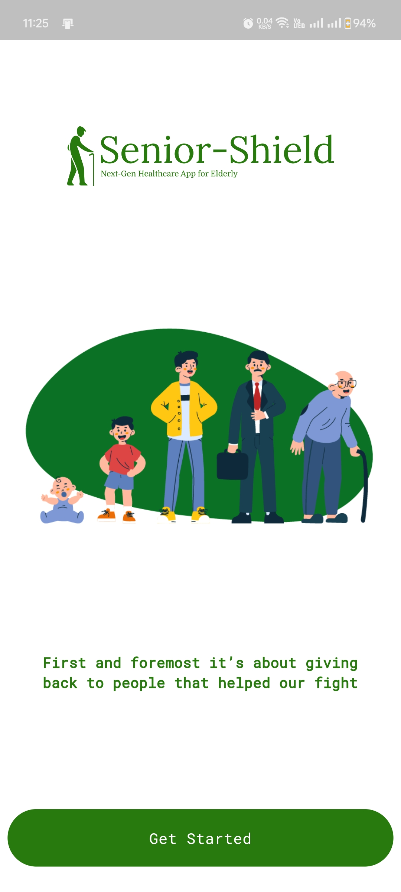
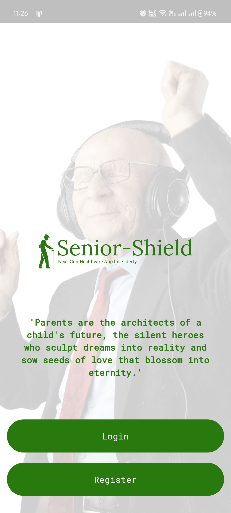
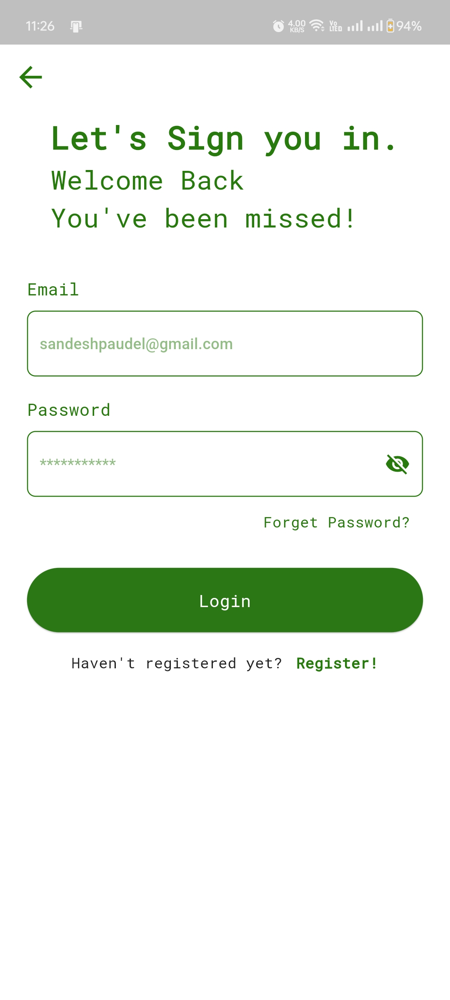
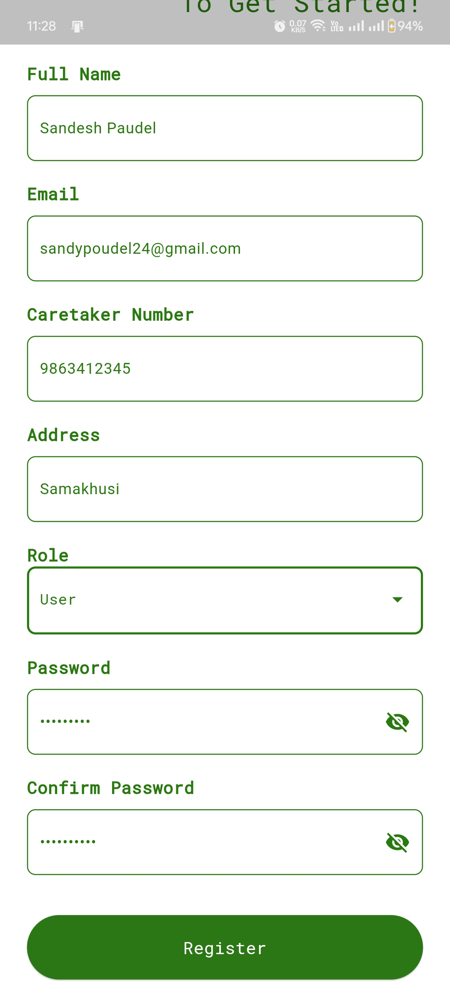
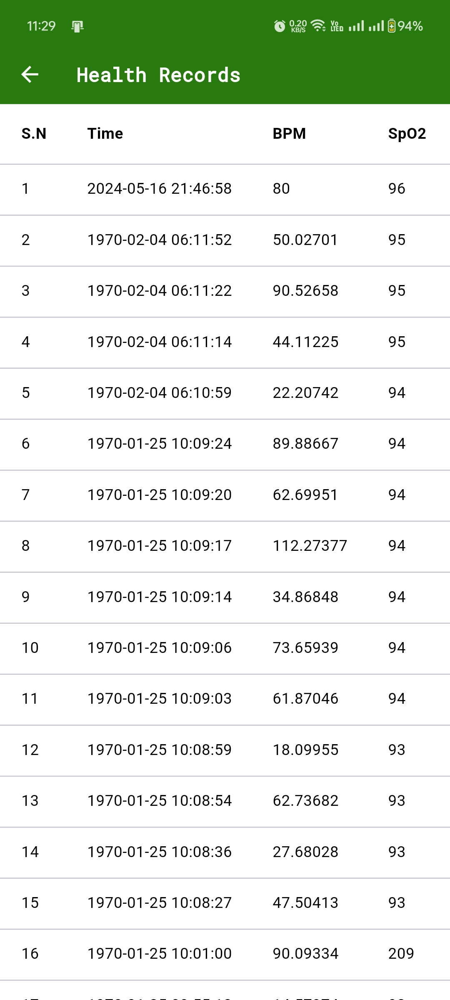
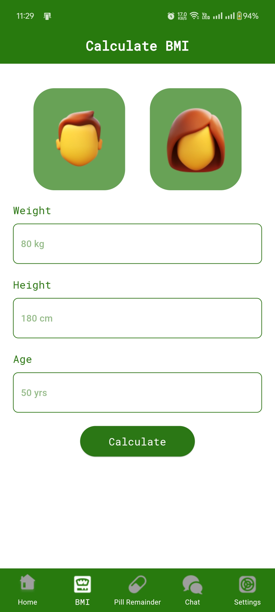
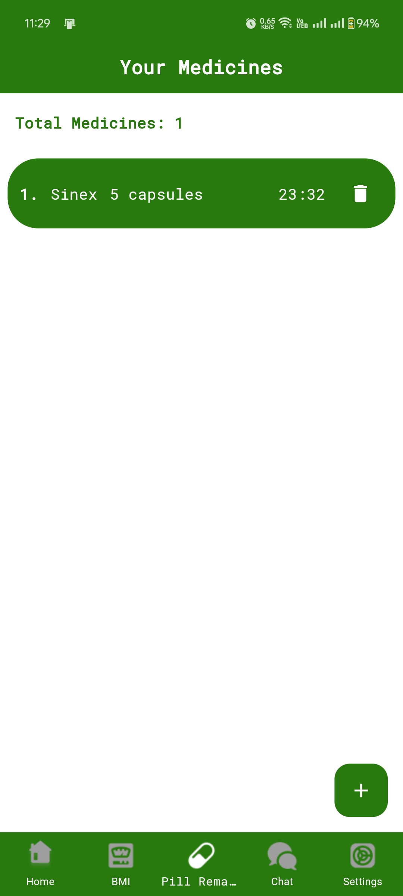

# Senior Shield- A Next-Gen HealthCare App for Elderly

## Overview
The Senior Shield project aims to develop a comprehensive healthcare monitoring system for senior citizens, integrating IoT devices with a user-friendly mobile application. The system provides continuous health monitoring, real-time alerts, medication reminders, health prediction using machine learning, and communication features for consultations with healthcare providers.

## Features
- #### Continuous Health Monitoring: 
    IoT devices send real-time health data to a central database, displayed on the mobile app.
- #### User Authentication and Security
    Robust authentication and data encryption mechanisms to protect sensitive health information.
- #### Alert and Notification System
    Real-time alerts for abnormal health conditions and fall detection, including SMS notifications.
- #### Health Prediction Using Machine Learning
    Health status predictions using a Random Forest algorithm based on collected health data.
- #### Medication Management
    Pill reminders with notifications to ensure medication adherence.
- #### Communication Features
    Chat functionalities for consultations with doctors and social interactions.
- #### Additional Health Tools
    BMI calculation and health awareness messages.

## Starting Screens

<table>
    <tr>
        <th>Splash Screen</th>
        <th>Walkthrough1</th>
        <th>Walkthrough 2</th>
    </tr>
    <tr>
        <td></td>
        <td></td>
        <td></td>
    </tr>
</table>

## Authentication and Authorization Screens

<table>
    <tr>
        <th>Login</th>
        <th>Registration</th>
        <th>Forget Password</th>
    </tr>
    <tr>
        <td></td>
        <td></td>
        <td></td>
    </tr>
</table>

## Features of Mobile Application

#### Home Page
<table>
    <tr>
        <th>Home Page</th>
        <th>All Health Records</th>
        <th>Health Alert Notification</th>
        <th>Health Alert SMS</th>  
    </tr>
    <tr>
        <td></td>
        <td></td>
        <td></td>
        <td></td>
    </tr>
</table>

#### BMI Calculation
<table>
    <tr>
        <th>BMI Screen</th>
        <th>Result Calculation</th>
    </tr>
    <tr>
        <td></td>
        <td></td>
    </tr>
</table>

#### Pill Reminder
<table>
    <tr>
        <th>Medicine Form</th>
        <th>Pill Reminder Screen</th>
        <th>Pill Notification</th>
    </tr>
    <tr>
        <td></td>
        <td></td>
        <td></td>
    </tr>
</table>

#### Chat Feature
<table>
    <tr>
        <th>Chat Page</th>
        <th>Individual Chat Screen</th>
    </tr>
    <tr>
        <td></td>
        <td></td>
    </tr>
</table>

#### Settings Screen
<table>
    <tr>
        <th>Settings Page</th>
    </tr>
    <tr>
        <td></td>
    </tr>
</table>

## Conclusion

The Senior Shield project successfully developed a comprehensive healthcare monitoring system tailored for senior citizens. The integration of IoT devices and machine learning technologies provides advanced health monitoring and predictive capabilities, while the user-friendly mobile application ensures ease of use. Despite various challenges, the project achieved its objectives, delivering a robust and versatile healthcare solution.

## Contributing

Contributions are welcome! Please read the [CONTRIBUTING.md](./CONTRIBUTING.md) file for guidelines on how to contribute to this project.

## License

This project is licensed under the MIT License. See the [LICENSE](./LICENSE) file for details.

## Contact

For any inquiries or support, please contact:
- Name: Sandesh Paudel
- Email: sandeshpaudel0618@gmail.com

---

Thank you for using Senior Shield! Your health and safety are our top priorities.
